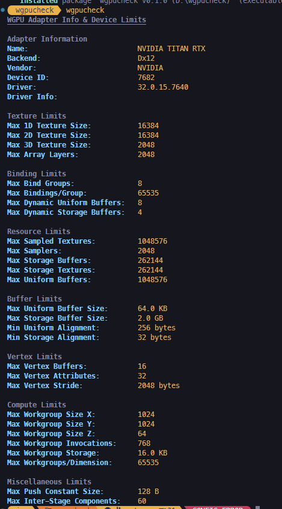

# wgpucheck

A simple cli tool to get a readout of your GPU's capabilities, as reported by WGPU:

Example output:
<p align="center">
  
</p>

<br>

# install
```sh
cargo install wgpucheck
```
or from source:
```sh
git clone https://www.github.com/alphastrata/wgpucheck
cd wgpucheck
cargo build --release
```

# Usage
```sh
wgpucheck --help
```
